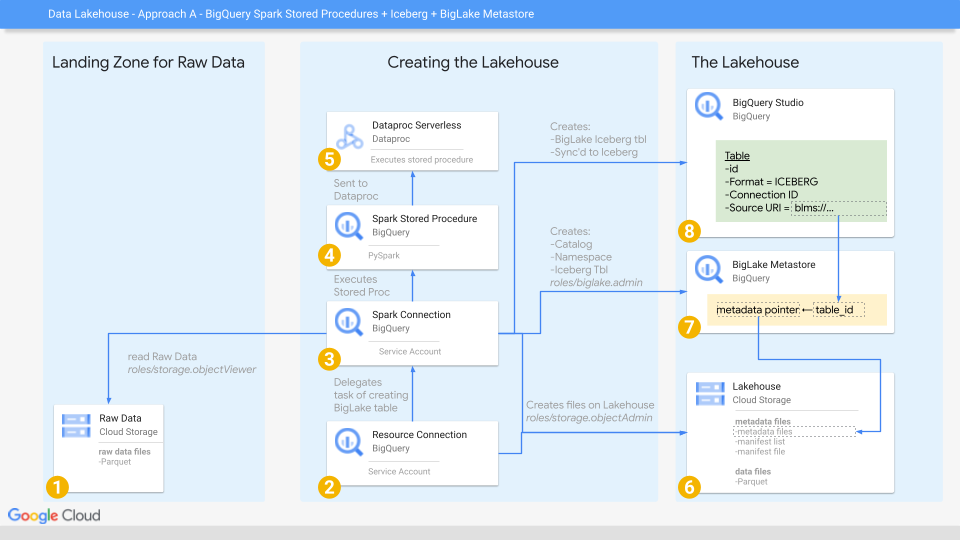
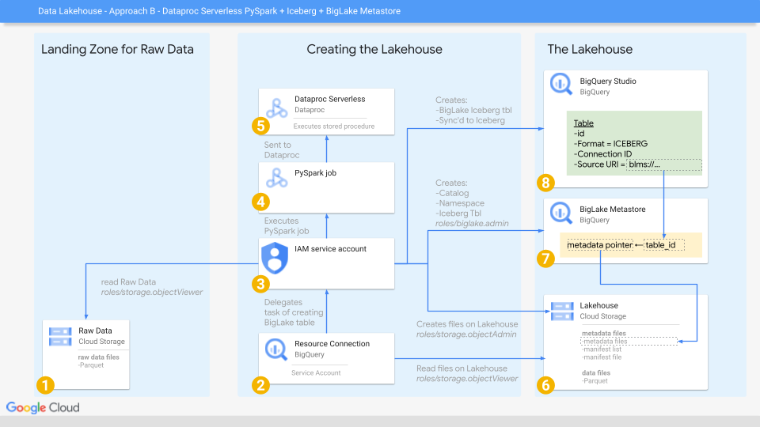

# biglake-iceberg-python

## What problem does this repo solve ? 

[Documentation](https://cloud.google.com/bigquery/docs/iceberg-tables) and [videos](https://www.youtube.com/watch?v=IQR9gJuLXbQ) for creating BigLake Iceberg tables is focused on 
using BigQuery PySpark Stored Proceures. 

For some teams this approach is not convenient. 

Documentation does not exist for other approaches, this creates fricton for teams
looking to get started with BigLake Iceberg tables. 

## What solution does this repo offer ? 

This repo offers detail instructions on different approaches to creating BigLake
Iceberg tables using Python & Spark.

This aims to reduce friction for teams looking to get started with BigLake Iceberg 
tables by hopefully included at least 1 approach aligned to their current architecture
and tech stack.

## Approach A : BQ Stored Procedures + BigLake Metastore + Spark + Iceberg

### Approach A  - Overview



1. A GCS bucket where we land our raw data, e.g. Parquet files 
2. A Cloud Resource BigQuery connection that delegates creating BigLake tables to #3
3. A Spark BigQuery connection that is the main driver of Lakehouse creation
4. A BigQuery Spark Stored Procedure that has the PySpark code to create our Lakehouse
5. A Dataproc serverless cluster that executes the store procedure #4
6. A GCS bucket which has the files of our Lakehouse (metadata + data files)
7. A BigLake Metastore which acts as our Iceberg catalog, mapping table IDs to metadat pointers
8. BigLake tables, automatically created at the same time as (& kept in sync with) Iceberg tables

### Approach A  - step 1 of 4 - Initial setup

Based on the instructions [here](https://youtu.be/IQR9gJuLXbQ?feature=shared) & 
also based on these [instructions](https://cloud.google.com/bigquery/docs/iceberg-tables)

create some environmental variables
```
export PROJECT_ID=$(gcloud config list core/project --format="value(core.project)")
export IAM_CUSTOM_ROLE_ID="CustomDelegate"
export BIGQUERY_LOCATION="US"
export GCS_LOCATION="US"
export BIGQUERY_STORED_PROCEDURE="my_biglake_stored_procedure"
export BIGQUERY_SPARK_CONNECTION="bigspark-connection"
export BIGQUERY_BIGLAKE_CONNECTION="biglake-connection"
export GCS_BUCKET_LAKEHOUSE="gs://${PROJECT_ID}-iceberg-datalakehouse"
export GCS_BUCKET_RAW_DATA="gs://${PROJECT_ID}-raw-data-parquet"
export GCS_BUCKET_RAW_DATA_TBL="${GCS_BUCKET_DATA}/my_cars_tbl/"
export LOCAL_DATA_LOCATION="data/mt_cars.parquet"
export GCS_BUCKET_DATA_LOC="${GCS_BUCKET_DATA_TBL}*.parquet"
export ICEBERG_CATALOG_NAME="my_datalakehouse_iceberg_catalog"
export ICEBERG_NAMESPACE_NAME="iceberg_datasets"
export BIGQUERY_DATASET="iceberg_datasets"
export ICEBERG_TABLE_NAME="cars"
export BIGQUERY_TABLENAME="cars"
```

enable apis
```
gcloud services enable iam.googleapis.com bigqueryconnection.googleapis.com biglake.googleapis.com
```

### Approach A  - step 2 of 4 - RAW Data / Landing Zone

create a GCS bucket

```
gcloud storage buckets create ${GCS_BUCKET_RAW_DATA} \
  --project=${PROJECT_ID} \
  --location=${GCS_LOCATION} \
  --uniform-bucket-level-access  
```

On your local machine, upload Parquet file to the data bucket
```
gcloud storage cp ${LOCAL_DATA_LOCATION} ${GCS_BUCKET_RAW_DATA_TBL}
```

### Approach A  - step 3 of 4 - Creating the Lakehouse

create a custom IAM role
```
gcloud iam roles create ${IAM_CUSTOM_ROLE_ID} \
  --project=${PROJECT_ID} \
  --title="${IAM_CUSTOM_ROLE_ID}" \
  --description="${IAM_CUSTOM_ROLE_ID}" \
  --permissions="bigquery.connections.delegate" \
  --stage=GA
```

create a bigquery dataset
```
bq --location=${BIGQUERY_LOCATION} mk \
  --dataset \
  ${PROJECT_ID}:${BIGQUERY_DATASET}
```
create a GCS bucket for our data lakehouse

```
gcloud storage buckets create ${GCS_BUCKET_LAKEHOUSE} \
  --project=${PROJECT_ID} \
  --location=${GCS_LOCATION} \
  --uniform-bucket-level-access
```

Create a BigQuery Apahce Spark [Connection](https://cloud.google.com/bigquery/docs/connect-to-spark#bq)
```
bq mk --connection \
  --connection_type='SPARK' \
  --project_id=${PROJECT_ID} \
  --location=${BIGQUERY_LOCATION} \
  ${BIGQUERY_SPARK_CONNECTION}
```

Grab the service account created for this connection
```
export SPARK_SA=$(bq show --format="json" --connection ${PROJECT_ID}.${BIGQUERY_LOCATION}.${BIGQUERY_SPARK_CONNECTION} | jq -r .spark.serviceAccountId)
```

Create a BigQuery Cloud Resource [Connection](https://cloud.google.com/bigquery/docs/create-cloud-resource-connection)
```
bq mk --connection \
  --connection_type='CLOUD_RESOURCE' \
  --project_id=${PROJECT_ID} \
  --location=${BIGQUERY_LOCATION} \
  ${BIGQUERY_BIGLAKE_CONNECTION}
```

Grab the service account created for this connection
```
export BIGLAKE_SA=$(bq show --format="json" --connection ${PROJECT_ID}.${BIGQUERY_LOCATION}.${BIGQUERY_BIGLAKE_CONNECTION} | jq -r .cloudResource.serviceAccountId)
```

Enable our Apache Spark connection to carry operations on GCS & BigQuery
```
gcloud storage buckets add-iam-policy-binding ${GCS_BUCKET_LAKEHOUSE} \
  --member="serviceAccount:${SPARK_SA}" \
  --role=roles/storage.objectAdmin

gcloud storage buckets add-iam-policy-binding ${GCS_BUCKET_RAW_DATA} \
  --member="serviceAccount:${SPARK_SA}" \
  --role=roles/storage.objectViewer

gcloud projects add-iam-policy-binding ${PROJECT_ID} \
  --member="serviceAccount:${SPARK_SA}" \
  --role=roles/biglake.admin

gcloud projects add-iam-policy-binding ${PROJECT_ID} \
  --member="serviceAccount:${SPARK_SA}" \
  --role=roles/bigquery.user
```

Use the BigQuery UI to allow the Spark Connection service account `SPARK_SA` to have
the custom role `CustomDelegate` on the Resource Connection `BIGQUERY_BIGLAKE_CONNECTION`.
This unfortunatley cannot be done via command line tools.

Use the BigQuery UI to allow the Spark Connection service account `SPARK_SA` to have
the role `BigQuery Data Owner` on the Dataset `BIGQUERY_DATASET`.
This unfortunatley cannot be done via command line tools easily.

Enable our Cloud Resource connection to carry out operations.
```
gcloud projects add-iam-policy-binding ${PROJECT_ID} \
  --member="serviceAccount:${BIGLAKE_SA}" \
  --role=roles/biglake.admin

gcloud storage buckets add-iam-policy-binding ${GCS_BUCKET_LAKEHOUSE} \
  --member="serviceAccount:${BIGLAKE_SA}" \
  --role=roles/storage.objectAdmin
```

Use the BigQuery UI to allow the BigQuery Cloud Resource service account `BIGLAKE_SA` to have
the role `BigQuery Data Owner` on the Dataset `BIGQUERY_DATASET`.
This unfortunatley cannot be done via command line tools easily.

**With the above setup complete, we use a BigQuery Spark Stored Procedure to create the Iceberg catalog + tables**

**An example stored procedure can be found [iceberg_stored_procedure.sql](/bigquery_stored_procedures/iceberg_stored_procedure.sql)**


Explaining the spark properties   

| Spark Property  | Value | Explanation |
| ------------- | ------------- | ------------- |
| spark.sql.catalog.`${ICEBERG_CATALOG_NAME}`  | org.apache.iceberg.spark.SparkCatalog  | An Apche Iceberg Catalog with name `${ICEBERG_CATALOG_NAME}`  should be created & managed using implementation class org.apache.iceberg.spark.SparkCatalog  |
| spark.sql.catalog.`${ICEBERG_CATALOG_NAME}`.catalog-impl  | org.apache.iceberg.gcp.biglake.BigLakeCatalog  | We are using a Custom Iceberg catalog implementation as defined by class org.apache.iceberg.gcp.biglake.BigLakeCatalog  |
| spark.sql.catalog.`${ICEBERG_CATALOG_NAME}`.gcp_project  | `${PROJECT_ID}`  | Required by the custom iceberg catalog implementation org.apache.iceberg.gcp.biglake.BigLakeCatalog. The GCP project that contains the catalog  |
| spark.sql.catalog.`${ICEBERG_CATALOG_NAME}`.gcp_location  | `${BIGQUERY_LOCATION}`  |Required by the custom iceberg catalog implementation org.apache.iceberg.gcp.biglake.BigLakeCatalog. Within GCP project, the GCP location that contains the catalog  |
| spark.sql.catalog.`${ICEBERG_CATALOG_NAME}`.blms_catalog  | `${ICEBERG_CATALOG_NAME}`  | Required by the custom iceberg catalog implementation org.apache.iceberg.gcp.biglake.BigLakeCatalog. The name of the BigLake Metastore catalog corresponding to this Iceberg Catalog.  |
| spark.sql.catalog.`${ICEBERG_CATALOG_NAME}`.warehouse  | `${GCS_BUCKET_LAKEHOUSE}`  | Warehouse location for the catalog to store data. This is a GCS bucket on Google Cloud. This single bucket will contain both the Iceberg metadata layer (metadata files, manifest list & manifest file) and the Iceberg data layer (Parquet files).   |
| spark.jars.packages  | org.apache.iceberg:iceberg-spark-runtime-3.3_2.12:1.2.0  | Includes the  Iceberg classes that Spark needs to interact with Iceberg tables and metadata.  |

### Approach A  - step 4 of 4 - Inspecting the Data lakehouse created

List out the catalogs created in the BigQuery BigLake Metastore

```
curl "https://biglake.googleapis.com/v1/projects/${PROJECT_ID}/locations/${BIGQUERY_LOCATION}/catalogs" \
  --header "Authorization: Bearer $(gcloud auth application-default print-access-token)" \
  --header "Accept: application/json"
```

List out databases in Catalog `${ICEBERG_CATALOG_NAME}`

```
curl "https://biglake.googleapis.com/v1/projects/${PROJECT_ID}/locations/${BIGQUERY_LOCATION}/catalogs/${ICEBERG_CATALOG_NAME=}/databases" \
  --header "Authorization: Bearer $(gcloud auth application-default print-access-token)" \
  --header "Accept: application/json"
```

List out tables in Catalog `${ICEBERG_CATALOG_NAME}` & database `${ICEBERG_NAMESPACE_NAME}`

```
curl "https://biglake.googleapis.com/v1/projects/${PROJECT_ID}/locations/${BIGQUERY_LOCATION}/catalogs/${ICEBERG_CATALOG_NAME=}/databases/${ICEBERG_NAMESPACE_NAME}/tables" \
  --header "Authorization: Bearer $(gcloud auth application-default print-access-token)" \
  --header "Accept: application/json"
```

## Approach B : Dataproc Serverless Batch Job + BigLake Metastore + Spark + Iceberg

### Approach B  - Overview



### Approach B  - step 1 of 4 - Initial setup

Based on the instructions [here](https://youtu.be/IQR9gJuLXbQ?feature=shared) & 
also based on these [instructions](https://cloud.google.com/bigquery/docs/iceberg-tables)

create some environmental variables
```
export PROJECT_ID=$(gcloud config list core/project --format="value(core.project)")
export CURRENT_USER=$(gcloud config list account --format "value(core.account)")
export IAM_CUSTOM_ROLE_ID="CustomDelegate"
export BIGQUERY_LOCATION="US"
export GCS_LOCATION="US"
export BIGQUERY_BIGLAKE_CONNECTION="biglake-connection"
export GCS_BUCKET_LAKEHOUSE="gs://${PROJECT_ID}-iceberg-datalakehouse"
export GCS_BUCKET_RAW_DATA="gs://${PROJECT_ID}-raw-data-parquet"
export GCS_BUCKET_RAW_DATA_TBL="${GCS_BUCKET_RAW_DATA}/my_cars_tbl/"
export LOCAL_DATA_LOCATION="data/mt_cars.parquet"
export GCS_BUCKET_DATA_LOC="${GCS_BUCKET_RAW_DATA_TBL}*.parquet"
export ICEBERG_CATALOG_NAME="my_datalakehouse_iceberg_catalog"
export ICEBERG_NAMESPACE_NAME="iceberg_datasets"
export BIGQUERY_DATASET="iceberg_datasets"
export ICEBERG_TABLE_NAME="cars"
export BIGQUERY_TABLENAME="cars"
export SERVICE_ACCT="dataproc-driver-sa"
export SERVICE_ACCT_FULL="${SERVICE_ACCT}@${PROJECT_ID}.iam.gserviceaccount.com"
export DATA_PROC_REGION=us-central1
export GCS_BUCKET_DATAPROC_DEPS="gs://${PROJECT_ID}-dataproc-deps"
export ICEBERG_SPARK_PACKAGE=org.apache.iceberg:iceberg-spark-runtime-3.3_2.12:1.2.0
export BIGLAKE_ICEBERG_CATALOG_JAR=gs://spark-lib/biglake/biglake-catalog-iceberg1.2.0-0.1.1-with-dependencies.jar
```

enable apis
```
gcloud services enable iam.googleapis.com bigqueryconnection.googleapis.com biglake.googleapis.com
```

### Approach B  - step 2 of 4 - RAW Data / Landing Zone

create a GCS bucket

```
gcloud storage buckets create ${GCS_BUCKET_RAW_DATA} \
  --project=${PROJECT_ID} \
  --location=${GCS_LOCATION} \
  --uniform-bucket-level-access  
```

On your local machine, upload Parquet file to the data bucket
```
gcloud storage cp ${LOCAL_DATA_LOCATION} ${GCS_BUCKET_RAW_DATA_TBL}
```

### Approach B  - step 3 of 4 - Creating the Lakehouse

create a custom IAM role
```
gcloud iam roles create ${IAM_CUSTOM_ROLE_ID} \
  --project=${PROJECT_ID} \
  --title="${IAM_CUSTOM_ROLE_ID}" \
  --description="${IAM_CUSTOM_ROLE_ID}" \
  --permissions="bigquery.connections.delegate" \
  --stage=GA
```

create a bigquery dataset
```
bq --location=${BIGQUERY_LOCATION} mk \
  --dataset \
  ${PROJECT_ID}:${BIGQUERY_DATASET}
```
create a GCS bucket for our data lakehouse

```
gcloud storage buckets create ${GCS_BUCKET_LAKEHOUSE} \
  --project=${PROJECT_ID} \
  --location=${GCS_LOCATION} \
  --uniform-bucket-level-access
```

create a service account to use to drive dataproc serverless batch pyspark jobs

```
gcloud iam service-accounts create ${SERVICE_ACCT} \
    --description="service acct for dataproc serverless jobs" \
    --display-name="${SERVICE_ACCT}"
```

Create a BigQuery Cloud Resource [Connection](https://cloud.google.com/bigquery/docs/create-cloud-resource-connection)
```
bq mk --connection \
  --connection_type='CLOUD_RESOURCE' \
  --project_id=${PROJECT_ID} \
  --location=${BIGQUERY_LOCATION} \
  ${BIGQUERY_BIGLAKE_CONNECTION}
```

Grab the service account created for this connection
```
export BIGLAKE_SA=$(bq show --format="json" --connection ${PROJECT_ID}.${BIGQUERY_LOCATION}.${BIGQUERY_BIGLAKE_CONNECTION} | jq -r .cloudResource.serviceAccountId)
```

Enable our service account to carry operations on GCS & BigQuery. Also, Enable our 
service account to execute "Dataproc dataplane operations". See [here](https://cloud.google.com/dataproc/docs/concepts/configuring-clusters/service-accounts#dataproc_service_accounts_2) & [here](https://cloud.google.com/dataproc/docs/concepts/iam/iam#dataproc-roles)
for documentation explaining the need for this in more depth.
```
gcloud storage buckets add-iam-policy-binding ${GCS_BUCKET_LAKEHOUSE} \
  --member="serviceAccount:${SERVICE_ACCT_FULL}" \
  --role=roles/storage.objectAdmin

gcloud storage buckets add-iam-policy-binding ${GCS_BUCKET_RAW_DATA} \
  --member="serviceAccount:${SERVICE_ACCT_FULL}" \
  --role=roles/storage.objectViewer

gcloud projects add-iam-policy-binding ${PROJECT_ID} \
  --member="serviceAccount:${SERVICE_ACCT_FULL}" \
  --role=roles/biglake.admin

gcloud projects add-iam-policy-binding ${PROJECT_ID} \
  --member="serviceAccount:${SERVICE_ACCT_FULL}" \
  --role=roles/bigquery.user

gcloud projects add-iam-policy-binding ${PROJECT_ID} \
  --member="serviceAccount:${SERVICE_ACCT_FULL}" \
  --role=roles/dataproc.worker 
```

Allow youself the permission to impersonate the new service account in order to use it
to launch new Dataproc Severless batch jobs.
https://cloud.google.com/iam/docs/service-accounts-actas

```
gcloud iam service-accounts add-iam-policy-binding \
    ${SERVICE_ACCT_FULL} \
    --member="user:${CURRENT_USER}" \
    --role="roles/iam.serviceAccountUser"
```

Use the BigQuery UI to allow the service account `SERVICE_ACCT` to have
the custom role `CustomDelegate` on the Resource Connection `BIGQUERY_BIGLAKE_CONNECTION`.
This unfortunatley cannot be done via command line tools.

Use the BigQuery UI to allow the Spark Connection service account `SERVICE_ACCT` to have
the role `BigQuery Data Owner` on the Dataset `BIGQUERY_DATASET`.
This unfortunatley cannot be done via command line tools easily.

Enable our Cloud Resource connection to carry out operations.
```
gcloud projects add-iam-policy-binding ${PROJECT_ID} \
  --member="serviceAccount:${BIGLAKE_SA}" \
  --role=roles/biglake.admin

gcloud storage buckets add-iam-policy-binding ${GCS_BUCKET_LAKEHOUSE} \
  --member="serviceAccount:${BIGLAKE_SA}" \
  --role=roles/storage.objectAdmin
```

Use the BigQuery UI to allow the BigQuery Cloud Resource service account `BIGLAKE_SA` to have
the role `BigQuery Data Owner` on the Dataset `BIGQUERY_DATASET`.
This unfortunatley cannot be done via command line tools easily.

**With the above setup complete, we use a PySpark job to create the Iceberg catalog + tables**

**An example PySpark can be found [iceberg_table_creation.py](/pyspark_jobs/iceberg_table_creation.py)**

Create a GCS bucket for the Dataproc jobs dependencies. Documentation on this can be 
found [here](https://cloud.google.com/dataproc-serverless/docs/quickstarts/spark-batch#submit_a_spark_batch_workload)

```
gcloud storage buckets create ${GCS_BUCKET_DATAPROC_DEPS} \
  --project=${PROJECT_ID} \
  --location=${GCS_LOCATION} \
  --uniform-bucket-level-access
```

The PySpark job is launched as follows: 

```
CONFS="spark.sql.catalog.${ICEBERG_CATALOG_NAME}=org.apache.iceberg.spark.SparkCatalog,"
CONFS+="spark.sql.catalog.${ICEBERG_CATALOG_NAME}.catalog-impl=org.apache.iceberg.gcp.biglake.BigLakeCatalog,"
CONFS+="spark.sql.catalog.${ICEBERG_CATALOG_NAME}.gcp_project=${PROJECT_ID},"
CONFS+="spark.sql.catalog.${ICEBERG_CATALOG_NAME}.gcp_location=${BIGQUERY_LOCATION},"
CONFS+="spark.sql.catalog.${ICEBERG_CATALOG_NAME}.blms_catalog=${ICEBERG_CATALOG_NAME},"
CONFS+="spark.sql.catalog.${ICEBERG_CATALOG_NAME}.warehouse=${GCS_BUCKET_LAKEHOUSE},"
CONFS+="spark.jars.packages=${ICEBERG_SPARK_PACKAGE}"

gcloud dataproc batches submit pyspark pyspark_jobs/iceberg_table_creation.py \
  --properties="${CONFS}" \
  --jars="${BIGLAKE_ICEBERG_CATALOG_JAR}" \
  --region="${DATA_PROC_REGION}" \
  --service-account="${SERVICE_ACCT_FULL}" \
  --deps-bucket="${GCS_BUCKET_DATAPROC_DEPS}" \
  --version=2.2 \
  -- --project_id=${PROJECT_ID} --iceberg_catalog_name=${ICEBERG_CATALOG_NAME} --iceberg_namespace_name=${ICEBERG_NAMESPACE_NAME} --iceberg_table_name=${ICEBERG_TABLE_NAME} --bigquery_dataset=${BIGQUERY_DATASET} --bigquery_table=${BIGQUERY_TABLENAME} --big_lake_connection="${PROJECT_ID}.${BIGQUERY_LOCATION}.${BIGQUERY_BIGLAKE_CONNECTION}" --source_data_parquet=${GCS_BUCKET_DATA_LOC}
```


**Explaining the spark properties in `CONFS`**

| Spark Property  | Value | Explanation |
| ------------- | ------------- | ------------- |
| spark.sql.catalog.`${ICEBERG_CATALOG_NAME}`  | org.apache.iceberg.spark.SparkCatalog  | An Apche Iceberg Catalog with name `${ICEBERG_CATALOG_NAME}`  should be created & managed using implementation class org.apache.iceberg.spark.SparkCatalog  |
| spark.sql.catalog.`${ICEBERG_CATALOG_NAME}`.catalog-impl  | org.apache.iceberg.gcp.biglake.BigLakeCatalog  | We are using a Custom Iceberg catalog implementation as defined by class org.apache.iceberg.gcp.biglake.BigLakeCatalog  |
| spark.sql.catalog.`${ICEBERG_CATALOG_NAME}`.gcp_project  | `${PROJECT_ID}`  | Required by the custom iceberg catalog implementation org.apache.iceberg.gcp.biglake.BigLakeCatalog. The GCP project that contains the catalog  |
| spark.sql.catalog.`${ICEBERG_CATALOG_NAME}`.gcp_location  | `${BIGQUERY_LOCATION}`  |Required by the custom iceberg catalog implementation org.apache.iceberg.gcp.biglake.BigLakeCatalog. Within GCP project, the GCP location that contains the catalog  |
| spark.sql.catalog.`${ICEBERG_CATALOG_NAME}`.blms_catalog  | `${ICEBERG_CATALOG_NAME}`  | Required by the custom iceberg catalog implementation org.apache.iceberg.gcp.biglake.BigLakeCatalog. The name of the BigLake Metastore catalog corresponding to this Iceberg Catalog.  |
| spark.sql.catalog.`${ICEBERG_CATALOG_NAME}`.warehouse  | `${GCS_BUCKET_LAKEHOUSE}`  | Warehouse location for the catalog to store data. This is a GCS bucket on Google Cloud. This single bucket will contain both the Iceberg metadata layer (metadata files, manifest list & manifest file) and the Iceberg data layer (Parquet files).   |
| spark.jars.packages  | `${ICEBERG_SPARK_PACKAGE}`  | Includes the  Iceberg classes that Spark needs to interact with Iceberg tables and metadata.  |

**Explaining the the flags inputted into `gcloud dataproc batches submit pyspark`**

| Flag | Value | Meaning |
| ------------- | ------------- | ------------- |
| positional  | pyspark_jobs/my-pyspark.py  | PySpark program to run  |
| properties  | ${CONFS}  | Spark properties to configure Spark to use BigLake Metastore as an Iceberg catalog  |
| jars  | ${BIGLAKE_ICEBERG_CATALOG_JAR}  | Custom Iceberg catalog implementation classes for BigLake Metastore  |
| region  | ${DATA_PROC_REGION}  | GCP region for running Dataproc Severless  |
| service-account  | ${SERVICE_ACCT_FULL}  | Service account to run Dataproc serverless job  |
| deps-bucket  | ${GCS_BUCKET_DATAPROC_DEPS}  | Required is launch a local file  |
| version | 2.2 | https://cloud.google.com/dataproc-serverless/docs/concepts/versions/dataproc-serverless-versions |
| --  | ARG1 ARG2  | TODO   |


### Approach B  - step 4 of 4 - Inspecting the Data lakehouse created

List out the catalogs created in the BigQuery BigLake Metastore

```
curl "https://biglake.googleapis.com/v1/projects/${PROJECT_ID}/locations/${BIGQUERY_LOCATION}/catalogs" \
  --header "Authorization: Bearer $(gcloud auth application-default print-access-token)" \
  --header "Accept: application/json"
```

cleaned up output
```
{
  "catalogs": [
    {
      "name": "projects/${PROJECT_ID}/locations/${BIGQUERY_LOCATION}/catalogs/${ICEBERG_CATALOG_NAME}",
      "createTime": "2024-08-29T19:59:18.939106Z",
      "updateTime": "2024-08-29T19:59:18.939106Z"
    }
  ]
}
```

List out databases in Catalog `${ICEBERG_CATALOG_NAME}`

```
curl "https://biglake.googleapis.com/v1/projects/${PROJECT_ID}/locations/${BIGQUERY_LOCATION}/catalogs/${ICEBERG_CATALOG_NAME}/databases" \
  --header "Authorization: Bearer $(gcloud auth application-default print-access-token)" \
  --header "Accept: application/json"
```

cleaned up output
```
{
  "databases": [
    {
      "name": "projects/${PROJECT_ID}/locations/${BIGQUERY_LOCATION}/catalogs/${ICEBERG_CATALOG_NAME}/databases/${ICEBERG_NAMESPACE_NAME}",
      "createTime": "2024-08-29T19:59:19.359421Z",
      "updateTime": "2024-08-29T19:59:19.359421Z",
      "type": "HIVE",
      "hiveOptions": {
        "locationUri": "gs://${GCS_BUCKET_LAKEHOUSE}/${ICEBERG_NAMESPACE_NAME}.db",
        "parameters": {
          "owner": "spark"
        }
      }
    }
  ]
}
```

List out tables in Catalog `${ICEBERG_CATALOG_NAME}` & database `${ICEBERG_NAMESPACE_NAME}`

```
curl "https://biglake.googleapis.com/v1/projects/${PROJECT_ID}/locations/${BIGQUERY_LOCATION}/catalogs/${ICEBERG_CATALOG_NAME}/databases/${ICEBERG_NAMESPACE_NAME}/tables" \
  --header "Authorization: Bearer $(gcloud auth application-default print-access-token)" \
  --header "Accept: application/json"
```

cleaned up output
```
{
  "tables": [
    {
      "name": "projects/${PROJECT_ID}/locations/${BIGQUERY_LOCATION}/catalogs/${ICEBERG_CATALOG_NAME}/databases/${ICEBERG_NAMESPACE_NAME}/tables/${ICEBERG_TABLE_NAME}"
    }
  ]
}
```

List out a specific table in Catalog `${ICEBERG_CATALOG_NAME}` 

```
curl "https://biglake.googleapis.com/v1/projects/${PROJECT_ID}/locations/${BIGQUERY_LOCATION}/catalogs/${ICEBERG_CATALOG_NAME}/databases/${ICEBERG_NAMESPACE_NAME}/tables/${ICEBERG_TABLE_NAME}" \
  --header "Authorization: Bearer $(gcloud auth application-default print-access-token)" \
  --header "Accept: application/json"
```

cleaned up output
```
{
  "name": "projects/${PROJECT_ID}/locations/${BIGQUERY_LOCATION}/catalogs/${ICEBERG_CATALOG_NAME}/databases/${ICEBERG_NAMESPACE_NAME}/tables/${ICEBERG_TABLE_NAME}",
  "createTime": "2024-08-29T19:59:20.897220Z",
  "updateTime": "2024-08-29T19:59:35.420513Z",
  "type": "HIVE",
  "hiveOptions": {
    "parameters": {
      "bq_table": "${BIGQUERY_DATASET}.${BIGQUERY_TABLENAME}",
      "uuid": "9f463d6f-...",
      "previous_metadata_location": "gs://${GCS_BUCKET_LAKEHOUSE}/${ICEBERG_NAMESPACE_NAME}.db/${ICEBERG_TABLE_NAME}/metadata/9d2e8a38-....metadata.json",
      "owner": "spark",
      "EXTERNAL": "TRUE",
      "numRows": "32",
      "bq_connection": "zaro-joonix-net-prj-data-batch.US.biglake-connection",
      "metadata_location": "gs://${GCS_BUCKET_LAKEHOUSE}/${ICEBERG_NAMESPACE_NAME}.db/${ICEBERG_TABLE_NAME}/metadata/579da4b2....metadata.json",
      "table_type": "ICEBERG",
      "totalSize": "4407",
      "numFiles": "1"
    },
    "tableType": "EXTERNAL_TABLE",
    "storageDescriptor": {
      "locationUri": "gs://${GCS_BUCKET_LAKEHOUSE}/${ICEBERG_NAMESPACE_NAME}.db/cars",
      "inputFormat": "org.apache.hadoop.mapred.FileInputFormat",
      "outputFormat": "org.apache.hadoop.mapred.FileOutputFormat",
      "serdeInfo": {
        "serializationLib": "org.apache.hadoop.hive.serde2.lazy.LazySimpleSerDe"
      }
    }
  },
  "etag": "Waf..."
}
```

Query the BigLake iceberg table using BIGQUERY
```
SELECT * FROM ${PROJECT_ID}.${BIGQUERY_DATASET}.${BIGQUERY_TABLENAME} LIMIT 10;"
```

### appendix :: manually deleting catalogs

```
curl -X DELETE "https://biglake.googleapis.com/v1/projects/${PROJECT_ID}/locations/${BIGQUERY_LOCATION}/catalogs/${ICEBERG_CATALOG_NAME}" \
  --header "Authorization: Bearer $(gcloud auth application-default print-access-token)" \
  --header "Accept: application/json"
```